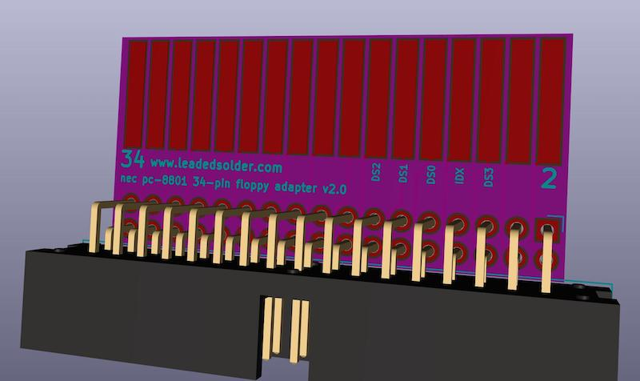
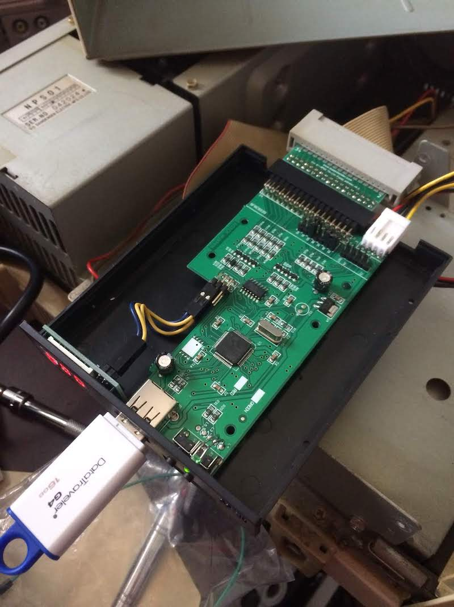

# This Project is Obsolete!
Hey! This project is now obsolete, and has been replaced by [the v3 floppy adapter project](https://github.com/barbeque/floppy-edge-connector-adapter). Please use that one instead.

# PC8801mkII floppy adapter
This adapter is intended to allow an NEC PC8801mkII to use a 34-pin floppy drive such as a Gotek or other Shugart floppy drive in lieu of its original 5.25" floppy drives.

(note that the connector goes on the other side on the real adapter:)

This expects the Gotek (or HxC) floppy emulator to be able to run in pure Shugart mode, as this adapter just converts the signals from the edge connector to a 34-pin floppy connector.

To run dual drives, you may have to make some jumper changes on the Goteks themselves. I had success with both drives set to `S0`.

# Tested On
 * NEC PC-8801mkII
 * NEC PC-8801mkIISR

# Version History
## v2.3
 * Added 45-degree chamfer
 * Added IBM PC style key slot

## v2.1
 * Removed solder mask from around fingers
 * Added extra "meat" to allow gold finger bevel at fabricator

# Bill of Materials
 * 34-pin female IDC right-angle header (0.100") such as [S9207-ND](https://www.digikey.ca/product-detail/en/sullins-connector-solutions/SFH11-PBPC-D17-RA-BK/S9207-ND/1990100) on DigiKey.
