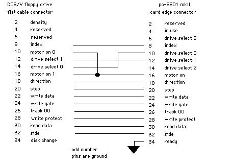

# PC8801mkII floppy adapter
This adapter is intended to allow a PC8801mkII to use a 34-pin floppy drive such as a Gotek.

It is based on an adapter cable designed by [Koichi Nishida](http://tulip-house.ddo.jp/DIGITAL/FD88/index.html). His schematic is as follows:

