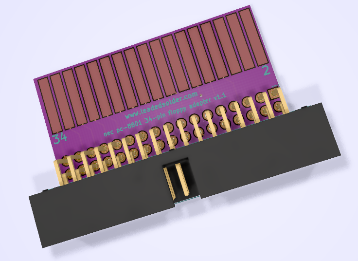

# PC8801mkII floppy adapter
This adapter is intended to allow an NEC PC8801mkII to use a 34-pin floppy drive such as a Gotek in lieu of its standard 5.25" floppy drive.

It is based on [an adapter cable designed by Koichi Nishida](http://tulip-house.ddo.jp/DIGITAL/FD88/index.html). His schematic is as follows:

Note that if you are using an HxC-enabled Gotek (which you should), this adapter is unnecessary. You can configure the Gotek or SD HxC to work in Shugart bus mode, which means you only need to attach a 34-pin IDC header to the existing ribbon cable.
